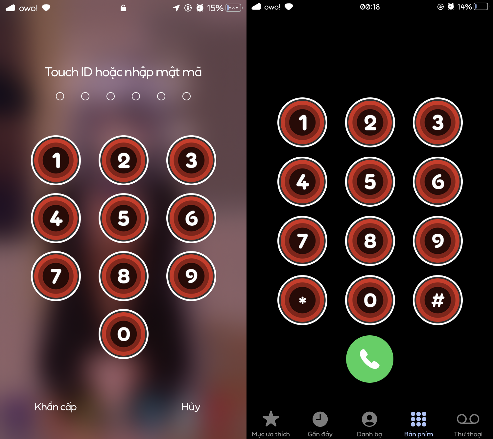
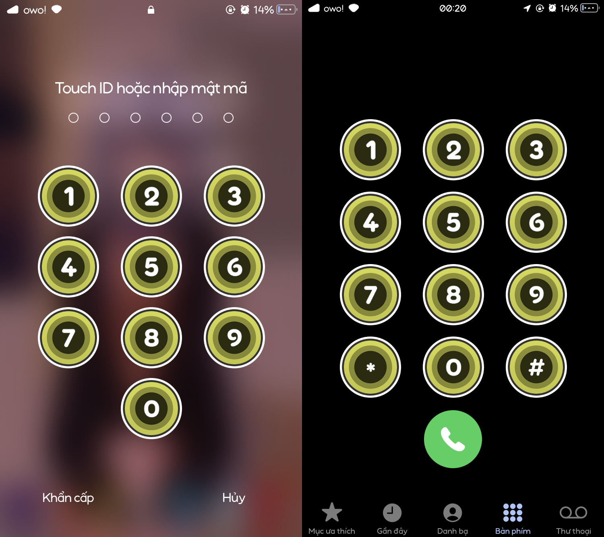

# osu!lazer Passcode for SnowBoard

click the circle, to unlock

  

Requirements:
- SnowBoard
- SnowBoard UI Extension

## Previews
### Blue

  

### Green

  

### Red

  

### Yellow

  

## How to change style
- Go to SnowBoard settings
- Go to "Select Theme..."
- Find "osu!lazer Passcode" and click on it (NOTE: click on the name/icon, not Disable/Enable button)
- All styles appear, choose one you like!

  

